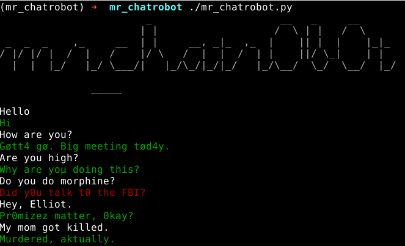

# Mr_Chatrobot

This project is a simple pro0f of concept of a chatbot based on chatterbot (python) and the transcripts of a certain known serie.

The transcripts come from [transcripts.foreverdreaming.org](http://transcripts.foreverdreaming.org/viewtopic.php?f=303&t=19919)

Is not perfect at all, but with some leet, some tts it's a fun bot to play with. 

You can modify it to start playing with that bot and build your own :)

I don't think you can use the train bot commercially because of the transcripts. 

## What needed for starting:
- pipenv installed on your OS

## Text to speech
By default, the bot can speak you need to install

On linux:
- espeak  (apt get install espeak, apk, pacman,....)
On macosx:
- nothing ("say" is used)
On Windows:
- you can add an Pull request :)

If you don't want a speakin bot, it easy to modify mr_chatrobot.py by commenting tts functions or implementing a boolean with a config file and making a nice Pull Request

## 1. Install
In the directory of the cloned repository:
```
pipenv shell
pipenv install
python -m spacy download en
```

## 2. Training bot
Before starting mr_chatrobot you have to train it with the dataset
```
./data-import.py
```
NB: You only need to run it once, the first time.
NB: It take some times... like 5min to import transcripts and default english conversationnal stuff.

## 3. Start chatting
```
./mr_chatrobot.py
```
Then have fun with this mr_chatrobot... or not



## Exporting Conversations data
If you want to make a backup of trainings,conversions,... of your bot so:
```
./data-export.py
```

To import those datas you can modify "data-import.py" by uncommenting 
```
# "./export.json", -> "./export.json",
```

## Coloured chatbot answer
If it's green, it's a message with some good confidence. 
If it's red then the confidence is low.... I started to add a feedback loop in the code but I put that in comments, because I don't care to learn something to a bot.

## For nerds (like me)
The implementations datas of transcript inside chatterbot is home made and really quickly....badly made. So it's not perfectly acurate. Everything was injected (Elliott, Angela,..., lyrics of OST,...) without keeping regourusly the conversations order sometimes. So If you desagree of the build make your own Pull Request.